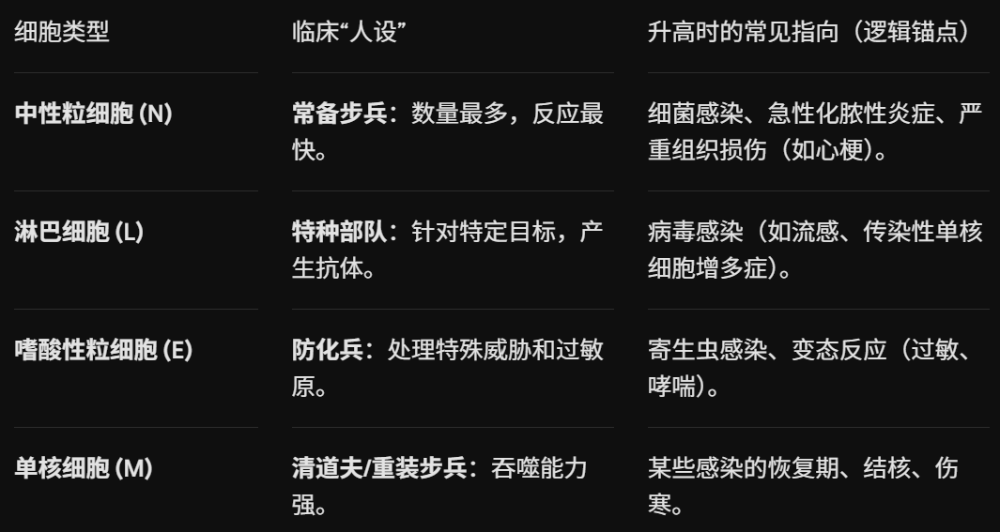

# 血常规与出凝血
## 白细胞系统
### 白细胞分类计数

## 红细胞系统
### MCV--平均红细胞体积
MCV 变小 (小细胞)： 原料不够（缺铁性贫血）。

MCV 变大 (大细胞)： 细胞核发育不良，细胞分裂受阻导致体积偏大（巨幼细胞性贫血，缺叶酸/维生素B12）。

大小正常 (正细胞)： 骨髓造血没问题，可能是突然失血，或者红细胞被破坏了（急性失血、溶血性贫血）。
### MCHC--平均红细胞血红蛋白浓度
通俗理解： 它是衡量“单辆卡车里装了多少货（血红蛋白）”的指标 。

临床意义：

MCHC降低（低色素性贫血）： 卡车里装的东西太少了。最常见的原因是缺铁性贫血，因为身体没铁（原料），造出的红细胞血红蛋白含量不足 。

MCHC正常（正色素性贫血）： 卡车里的货量是正常的，但这辆卡车可能本身就是坏的，或者是由于失血导致数量减少 。

记忆逻辑： 它是“质量”的体现，主要看红细胞是不是“营养不良”或者“偷工减料”。

### RDW--红细胞体积分布宽度 (Red cell Distribution Width)

通俗理解： 它是衡量“所有卡车的大小是否整齐划一”的指标 。

如果所有红细胞大小都一样，RDW就低（数值正常）。

如果红细胞有的特别大，有的特别小，RDW就高。

临床意义：

RDW升高（大小不一）： 说明红细胞群在造血过程中出了乱子，有的发育完全，有的发育不完全，这是许多贫血（如缺铁性贫血）早期的关键征象 。

RDW正常： 所有红细胞大小相对一致。例如在轻型地中海贫血中，RDW往往是正常的，这可以用来和缺铁性贫血做鉴别诊断。

# 出凝血
## 凝血酶原酶复合物 (Prothrombinase Complex) 
这是由因子 Xa、因子 Va、磷脂 (PL) 和钙离子 (Ca²⁺) 共同组成的复合物 。它的作用是将凝血酶原（因子 II）转化为凝血酶（因子 IIa），这是凝血过程的核心步骤 。