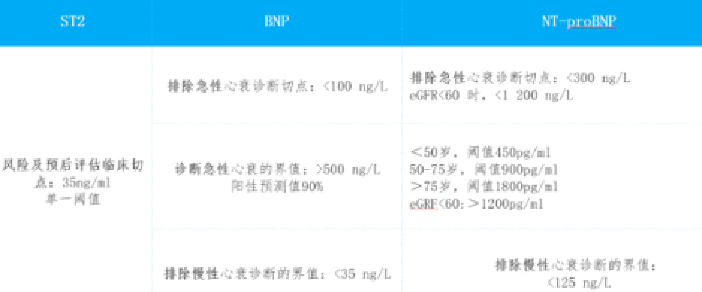
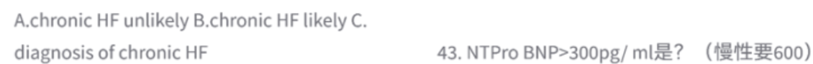

# 生化免疫
## 大题
### 血脂
APO载脂蛋白
TCHO（或 TC） 是 Total Cholesterol 的英文缩写，临床上称为“总胆固醇”。

### 心肌损伤标志物
#### 冠状疾病的两级风险预测所涉及的指标以及结果分析
• 谁需要被检测?
需作冠心病风险预测的人群，特别是胆固醇异常者
• CRP 单独检测或与其他项目联合检查?与 TC:HDL 一起更具意义
• 检测值如何界定风险?
low risk <1; medium risk = 1-3; high risk >3 mg/L 
• 如何排除急性时相反应?
验证结果 >3 mg/L （第二次检测结果）
(并观察胆固醇值)
排除结果 > 10 mg/L--急性时相反应

谁需要被检测、何时检测?
稳定性心绞痛的任何时间
不稳定性心绞痛的启始（或结束后）
AMI急性期过后 ( ~3 周以后)
patients undergoing PTCA pre-procedural
• CRP 单独检测或与其他项目联合检查?
和 Troponin I or T
• 检测值的判读?
CRP >3mg/L predicts increased risk for a combined end point of cardi
ac death, myocardial infarction, recurrent instability or restenosis after 
PTCA
CRP >10mg/L predicts increased risk of death
#### 急性心衰的实验室诊断常用指标及使用的注意事项

## 选择
### BNP和NT-proBNP
慢排除：35 / 125

急排除：100 / 300

急确诊：BNP 看 500；NT-proBNP 玩翻倍
（450 ➡️ 900 ➡️ 1800）。

### 肝癌和黄疸确诊可用什么指标？
甲胎蛋白AFP--原发性肝癌特异性最高的肿瘤标志物
    若血清 AFP ≥ 400 μg/L，持续 4 周以上，并在排除妊娠、活动性肝病及生殖腺胚胎源性肿瘤后，结合影像学表现可确诊肝癌。

若 AFP ≥ 200 μg/L，持续 8 周以上，也具有高度诊断价值。

异常凝血酶原（DCP/PIVKA-II）

其他辅助标志物（AFU，γ-GGT或GGT）

HCG（人绒毛膜促性腺激素，Human Chorionic Gonadotropin）是一个极其重要的糖蛋白激素。
HCG 还可以作为某些肿瘤的肿瘤标志物，例如男性的睾丸癌（生殖细胞恶性肿瘤）、卵巢癌等，当这些肿瘤组织内含有滋养层细胞成分时，也会引起血清 $\beta$-HCG 异常升高。

肌酐测试（Creatinine Test）主要反映的脏器受损是肾脏。它是评估肾功能（尤其是肾小球滤过功能）最经典、最常用的临床生化指标之一。

### 53.肾脏滤过率最有效检测指标?eGFR(菊粉?)
关于肾小球滤过率（GFR）的检测指标，您提到的“菊粉”和“eGFR”恰好分别代表了理论上的金标准和临床常规最实用指标。在医学考试和临床应用中，我们需要根据具体的定语来区分“最有效”的含义：1. 理论上的“金标准”：菊粉清除率（Inulin）地位：被公认为测定GFR的经典绝对金标准。机制：菊粉能完全自由通过肾小球滤过膜，且在肾小管中既不被重吸收，也不被分泌，能100%准确反映滤过率。临床现实：由于它是外源性物质，需要持续静脉滴注，并多次进行复杂的抽血和留尿，操作极度繁琐且昂贵。因此，临床常规基本不使用，主要仅限于科研。2. 临床常规筛查与随访的首选：eGFR（估算肾小球滤过率）临床上无法常规测菊粉，因此采用血液中的内源性标志物代入公式来“估算”GFR，即eGFR。基于血肌酐（Scr）的eGFR：最普及。但肌酐受肌肉量、年龄、饮食影响较大，且存在“肾脏代偿盲区”（只有当GFR下降超过一半时，肌酐才会明显升高）。基于胱抑素C（Cystatin C）的eGFR：目前公认更灵敏的早期指标。胱抑素C的产生极度恒定，不受性别、肌肉量和炎症影响，对早期肾小球滤过功能受损的检测比肌酐敏感得多。3. 临床精准测定的“替代金标准”：放射性核素显像（测定mGFR）结合您上传的《放射性核素显像》等资料，当临床需要极其精准地确诊肾功能（如供肾评估、化疗前评估）时，最有效的检测手段是核素肾动态显像。常用示踪剂：99mTc-DTPA（锝[99mTc]二乙三胺五乙酸）。优势：DTPA的体内排泄机制与菊粉高度相似（几乎全由肾小球滤过），不仅能准确测定总GFR，还能无创测定分肾GFR（单独看左肾或右肾的滤过率），这是抽血化验（eGFR）绝对做不到的。考点与临床总结：如果题目问“金标准”或“最准确能反映GFR的物质” $\rightarrow$ 选菊粉（Inulin）清除率。如果题目问“早期/灵敏反映”肾小球滤过功能的血液指标 $\rightarrow$ 选胱抑素C（Cystatin C）。如果题目问“临床最常用/首选”的评估指标 $\rightarrow$ 选eGFR。如果要精确评估“分肾滤过率” $\rightarrow$ 选99mTc-DTPA核素显像。