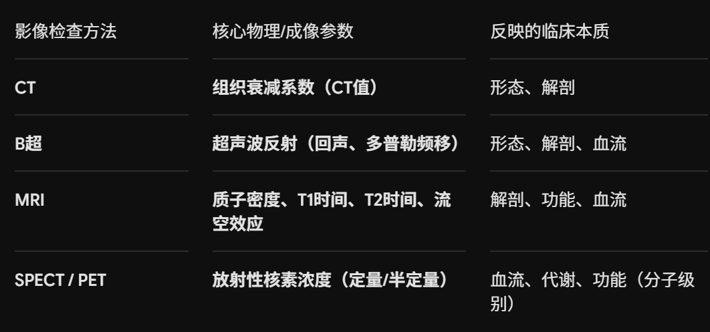
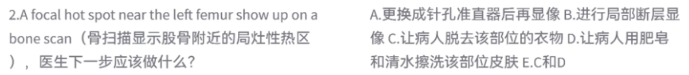

## X线成像的因素（英文）
“X线成像因素”的英文表达：
在医学影像学中，“X线成像因素”或“影响X线成像的因素”通常翻译为：

Factors of X-ray Imaging * 或 Factors affecting X-ray imaging

核心的成像三要素英文分别为：

X-ray source（X线源/管电压、管电流）

Object / Patient（被照体/人体组织的密度与厚度差异）

Image receptor（图像接收器/探测器）

MRI的成像参数不包括：组织衰减系数（这是CT的核心成像参数）

## superconductive MR machine多少T？
根据医学影像设备学和《放射性核素显像》课件中关于 MRI 主磁体的分类，这道题的正确答案是：1.5T 或 3.0T（通常临床考试中如果是单选题，标准答案多为 1.5T ~ 3.0T，或者直接问高场强代表时填 3.0T）。

题目问的是“superconductive MR machine 多少 T（超导 MR 机的磁场强度）”。

## 
“骨扫股骨见热区，莫急诊断骨转移；大腿根部尿污染，脱衣洗皮再重拍。”
为什么要脱衣物（C）和擦洗皮肤（D）？尿液污染最常见：$^{99\text{m}}\text{Tc-MDP}$ 主要是通过肾脏排泄随尿液排出体外的。患者在排尿时，极易将含有高浓度放射性显像剂的尿液不小心沾染到内裤、外衣或大腿根部（股骨附近）的皮肤上。伪影误诊：如果在显像时这些被污染的衣物或皮肤还在，仪器就会在体外探测到极高的放射性，在图像上表现为一个亮白或暗黑的“局灶性热区”，极其容易被误诊为“股骨骨转移”！处理原则：因此，一旦在腹股沟、股骨、会阴部附近发现孤立的热区，第一步永远是“去污染”——让患者脱掉可能被尿液污染的衣物（C），并用肥皂水清洗局部皮肤（D），然后重新进行局部拍摄。如果重新拍摄后热区消失了，说明是尿污染；如果热区还在，才考虑是真正的骨骼病变。

## 超声
### 超声回声从大到小排序：
第一步：掌握回声大小的“物理本质”
在超声图像上，界面越多、纤维/脂肪/骨质越多，回声就越白（越强）；液体越多、成分越均匀，回声就越黑（越弱）。

我们将你给出的组织划分为4个“回声梯队”来理解：

强回声（极白）：肺、骨骼。肺里全是空气，骨骼密度极高，超声在这些界面全反射，回声最大。

高回声（很白）：肾窦（肾中央区）、胰腺、胎盘。肾窦内含有大量脂肪和血管壁，组织界面极多；胰腺随年龄增长脂肪化，胎盘内血管和绒毛结构丰富，所以它们很白。

等/低回声（灰色）：肝、脾实质 ＞ 肾皮质 ＞ 肾髓质。这是最常考的“实质脏器大PK”。肾皮质细胞多，肾髓质（肾锥体）里面全是尿液管道（水多），所以髓质比皮质更黑。

无回声（死黑）：血液 ＞ 胆汁、尿液。纯液体不产生反射，基本是黑色的。血液里有红细胞会有微弱散点，而胆汁和尿液最纯净，回声最小。

第二步：配套核心速记口诀（直接背诵）
我们可以把这串长排序串联成一个“医院检查场景”的趣味口诀：

骨肺最强呈死白，（骨骼、肺）
肾窦姨娘怀胎盘；（肾窦 ＞ 胰腺、胎盘）
肝脾实质夹中间，（＞ 肝、脾实质）
皮质髓质退两边；（＞ 肾皮质 ＞ 肾髓质）
血液流过不留痕，（＞ 血液）
胆汁尿液黑出天。（＞ 胆汁和尿液）

第三步：考点拆解与逐句对应
“骨肺最强呈死白” ➡️ 骨骼、肺（最强的两个极端反射面）。

“肾窦姨娘怀胎盘” ➡️ 紧接着是肾窦（肾中央区），然后是胰腺（谐音：姨）和胎盘（谐音：怀胎盘）。

“肝脾实质夹中间” ➡️ 到了中间最庞大的肝、脾实质。

“皮质髓质退两边” ➡️ 这是标志性的肾脏内部对比：肾皮质 ＞ 肾髓质（肾锥体）。

“血液流过不留痕，胆汁尿液黑出天” ➡️ 进入无回声区，流动有红细胞的血液，大于最纯净、回声最小的胆汁和尿液。

### 胆疾病有关的B超?
胆囊息肉表现为突向胆囊腔与壁相连的中强回声，后方不伴声影，不随体位改变而移动;胆囊结石表现为胆囊腔内的强回声后方伴声影可随体位改变而移动

## 其他
11.应用生理性药物刺激/干预后显像的是?（A.静态显像B.平面显像**C.介入显像**D.阴性显像E.阳性显像）

介入显像（Interventional Imaging）的定义：
是指在核医学显像过程中，通过给患者应用生理性、物理性或药物的刺激与干预，动态观察脏器、组织功能或血流受刺激前后的变化对比。其核心目的是为了提高对某些隐匿性病变的检出率或借此评估脏器的储备功能。