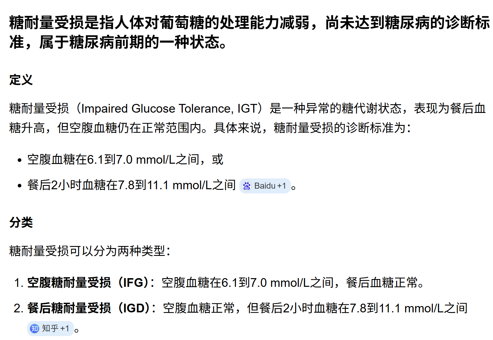
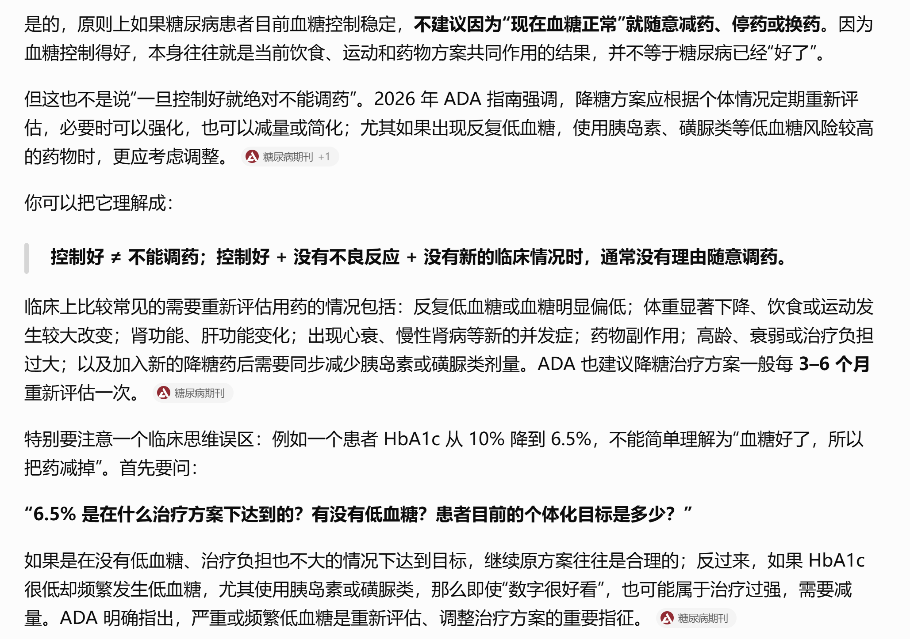

## 定义
**胰岛素**分泌不足或靶细胞对胰岛素敏感性下降（胰岛素抵抗）等原因，引起葡萄糖、脂肪、蛋白质以及电解质、酸碱平衡等代谢紊乱。以**高血糖**为共同只要特征，常伴有心脑血管、肾脏、神经、眼部等器官的慢性并发症，严重时可因酮症酸中毒、高渗性昏迷等急性代谢紊乱而威胁生命。

## 诊断标准

糖尿病症状，同时任意血糖≥11.1mmol/L

空腹血糖FPG≥7.0mmol/L

OGTT中，2h血糖≥11.1mmol/L

一项可疑，两项确诊

## 糖尿病历史
糖尿病是生理性疾病，也是社会性疾病，会引起各种死亡人数增加，发病危险因素包括：遗传因素、肥胖、高龄、缺少体育活动
--节俭基因表达充分的种族，突然面临吃饱了撑的习惯
--生产商追求利润，利润向需求靠拢；人的天性是偷懒--“遥控器”的历史
--科学和医学的进步，年龄越来越网上长，胰岛功能下降是衰老性疾病

肥胖症的指南--中国中央人民政府公布的
从前讲课--营养素缺乏，现在讲课--各种过剩
黄帝内经--“消渴症”

## 糖尿病的分类
1型，2型，其他特殊类型（继发性糖尿病）--发病机制和基因弄得非常清楚，妊娠糖尿病（GDM）

### 妊娠糖尿病
妊娠糖尿病--在妊娠期才发现或才被诊断的糖尿病或糖耐量异常，怀孕前已经已经诊断者称糖尿病合并妊娠

#### 影响：骨骼肌肉大脑影响
孩子在母体内不能呼吸，需要通过母体的血液携带氧气，供给孩子的骨骼、肌肉、大脑生长，如果母体有糖尿病，孩子会吞咽大量甜的羊水，孩子会迅速长大，变成巨大胎儿，但胚胎期最应该增长的是大脑，其次是骨骼肌肉。供给系统通过胎盘，但这么大的肌肉和骨骼，对大脑的供应就不足，且有生产风险。

人类作为生物，最优的是大脑，人类的进步过程中女性承担了最大的痛苦和麻烦。

非常从严，一点高血糖都不能有。【0容忍】

## 糖尿病的病因和发病机制
遗传、环境、免疫
### 遗传
遗传缺陷不是1型的首要病因，但1型的白细胞抗原和某些表型和正常人有明显差异。
2型糖尿病有家族史，2型患者糖尿病父母所生子女，患糖尿病的机会超出普通人群10-30倍。
无法基因治疗，因为该沉默糖尿病基因可能导致癌症反应。
改变环境因素：限制嘴巴，加强运动。

肥胖，尤其是腹型肥胖，是2型糖尿病发病最主要的环境因素。

## 临床表现
### 主要表现是三多一少和乏力

2型多为渐进性，症状很轻，往往口服降糖药就可以了
血糖越高，蛋白损伤越严重，容易导致血管病变
--糖尿病微血管并发症
--糖尿病容易感染--化脓性感染，需要溶酶体来消除，溶酶体就是蛋白酶，然后淋巴因子也是蛋白，但糖尿病蛋白分解增多、合成减少

## 诊断
尿糖不能用于确诊，只是一个方便的指标
黄金标准是血糖，这也是唯一的标准
糖耐量：空腹或餐后血糖高于正常但又未达到诊断标准
--从严标准：孕妇
糖基化血红蛋白（HbA1c测定）--该指标用于评价糖尿病患者近3-4月内的血糖总体空置情况1，该指标持续升高被认为是发生视网膜或肾病等慢性并发症的一个危险因素

胰岛素及胰岛素释放试验--用于1型患者和2型患者的鉴别

诊断3个标准：有无糖尿病，对糖尿病进行分型；判断是否存在糖尿病并发症

## 治疗（饮食、运动、药物、教育、监测）
“久病成良医”
根据标准体重和工作性质，计算每日总热量，然后分配为糖、脂肪和蛋白质所占的比例
最好别吃糖，但可以吃饭--因为吸收速度不同

## 药物
SGLT-2容易产生尿路感染
胰高血糖素样肽-1

-------
1919第一次世界大战结束，五四运动，全世界是和平的力量，从军工的研究转向科学的研究
胰岛素使得T1DM从2年半生存期的绝境走向天寿--诺贝尔奖
哲学和科学是相通的

知多知少难知足，人类主宰一切时往往是荒谬的，糖尿病时代还没有过去
现在胰岛素针头可以基本做到无痛注射，且存在长效胰岛素，现在还有一周打一针的

-------

## 并发症
### DKA
血糖高以后，糖不能充分利用，分解脂肪，大量脂肪分解超过人体，就叫酮症；影响到水电解质平衡，叫酸中毒，易导致昏迷

治疗：尽快补液，补盐水，柔和小剂量胰岛素（因为迅速降血糖会导致脑水肿，高血糖的时候会脑缺水），酸中毒（钾高，预见性补钾），慎重补碱