# 心力衰竭
“21世纪两个没有攻克的堡垒--房颤与心力衰竭”
# 定义
“不能满足需要”≠心排血量减少（多种类型心律衰竭）

心脏有适量静脉回流的情况下，不能维持足够的心排血量以满足阻滞代谢需要的一种综合征。

又称心功能不全

【外科】休克定义：心脏静脉回流不足，不能维持足够的心排血量。

## 新的进展
### 2024中国心衰诊断与治疗指南etc,.
大于35岁心衰患病率已在1.3%
心衰恶性程度与肿瘤相当--普及度与依从性之间的矛盾

心力衰竭是有症状的临床综合征--病因+诱因
心力衰竭是自发进展性疾病--不断激活--失代偿

【流程图】
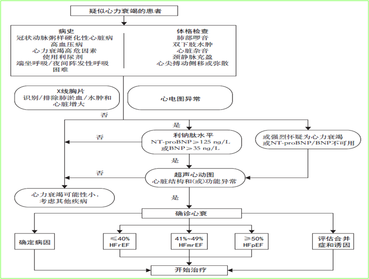
病史症状和体征 + X线/心电图 + 利钠肽检测（核心检测）+超声心动图（心室结构/功能异常--射血分数）

【慢性HFrEF治疗过程/不同治疗方案对HFrEF患者全因死亡率的减低作用】

/ 类似中药多靶点治疗 /
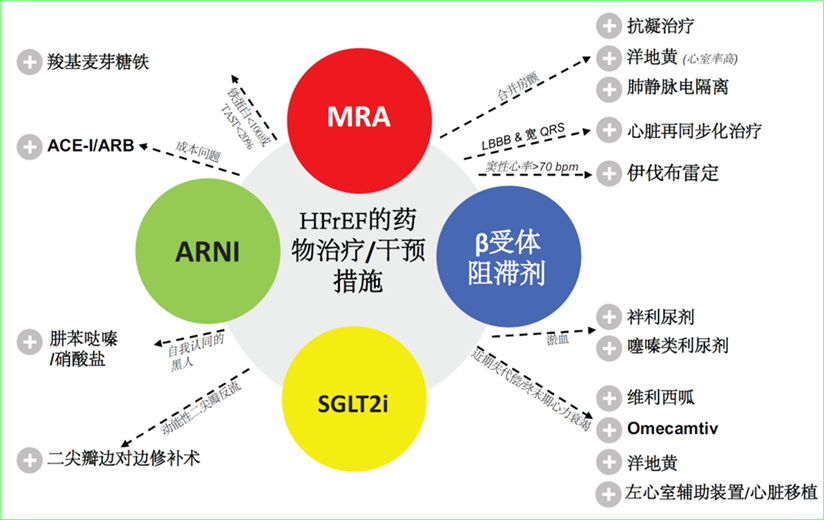
【HFpEF--I类推荐】共性治疗--恩格列净和达格列净--终身使用除非患者有禁忌症

### 其他相关内容
急性心梗再灌注治疗--药物溶栓，介入手术急性PCI，冠状动脉搭桥术

年轻人急性心衰常见的原因和病因--急性心肌炎--感冒要好好的休息（爆发性心肌炎治疗率小于10%）

肺循环与体循环的不同

只表现右心衰而不表现为左心衰--肺栓塞
（肺心病病人会导致低氧血症--会导致左心衰竭）
#### 瓣膜病
梨型心--二狭
心尖部舒张期隆隆样杂音--二狭
胸骨右缘第二肋间收缩期喷射样杂音--主狭
胸骨左缘第二肋间机器样连续性杂音--动脉导管未闭

## 分类
1. 根据临床表现，分为前向型和后向型
2. 根据症状表现--初诊--无症状无心衰--有效治疗使症状缓解
3. 心排血量--高心排血量型（需要量大：甲亢、B维生素缺乏、动静脉瘘、动脉导管未闭、妊娠）和低排血量型--新排血量不是判断心衰的主要指标
4. 发生机制--收缩性和舒张性--“新四联、五朵金花的药物”--听FranK-Starling机制--
   1. 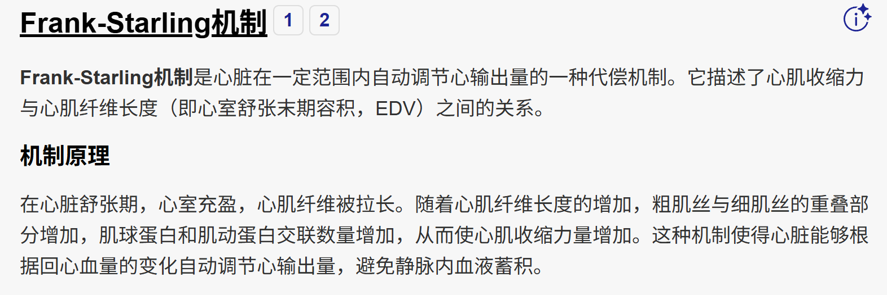
5. 根据LVEF 射血分数减低性、射血分数轻度降低--初诊和评估--超声心动图有5%的误差

## 病因与诱因
### 基本病因
1. 原发性心肌损害
2. 心室负荷过重

### 诱因
1. 感染
2. 心律失常
3. 血容量增加，钠盐过多，输液过多过速等

# 1. 慢性心力衰竭

## 心力衰竭分级与Killip分级
### Killip分级 
+ 首先看有无心源性休克，有心源性休克就是Ⅳ级
中下肺布满湿啰音 ＞50%
### 心衰NYHA分级
#### 重要症状体征：乏力、心悸和呼吸困难（考题往往把水肿放进去）
+ 爬两层楼以上--II
+ 平地走--III
+ 6分钟步行实验（150 450）
### 2001年ACC/AHA慢性心衰诊断治疗指南提出心衰分期方法--ABCD
+ A期：心衰高危但没有心脏结构或功能损害（五年生存率98%）
+ B期：有心脏结构或功能损害，但是没有心衰症状（五年生存率97%，所以**心力衰竭的诊断要从C期开始**）
+ C期：有心脏结构或功能损害，并且既往或目前有心衰症状
+ D期：需要特殊干预治疗的难治性心衰

## 心衰的临床表现
+ 左心衰以肺循环淤血与心排血量降低为主要表现
  + 出现最早：劳力性呼吸困难--也是进展性
  + 特殊表现形式：夜间阵发性呼吸困难（区分：阻塞性呼吸暂停）
  + 最严重症状：心源性哮喘
  + 心脏杂音：二尖瓣关闭不全、奔马律
  + 脉搏：**交替脉（Pulses Alternates）**
+ 右心衰竭以体循环淤血为主要表现（**右心衰出现时反而使左心衰的症状减轻**）
  + 最常见症状：消化道症状eg.,**食欲不振**
  + 主要体征：颈静脉征，下肢坠积性水肿（体检时候要翻身）
  + **特征性：肝颈静脉反流征阳性**（【结业考试动作/常见考题】：**半卧位**，头转向左侧，双手按压肝区往上推，观察颈静脉充盈度是否超过1/3）（PS：另一考题：心肺复苏）
  + 心脏杂音：三尖瓣关闭不全杂音、
  + 脉搏：奇脉（PS水冲脉--甲状腺功能亢进、动脉导管未闭、严重贫血）
+ 警惕：左心衰肺淤血症状缓解，警惕全心衰
+ 其他积累点
    + 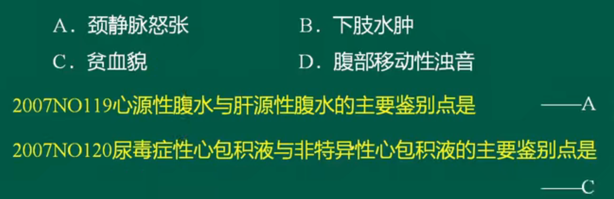
    + 房颤是引起心衰最常见的心律失常

## 辅助检查 
1. 实验室检查
   1. 利钠肽（是否疾病 预后）
    窦性心动过速的时候BNP可有明显增高
2. 影像学检查
   1.  首选 超声心动图
       1. 收缩功能 射血分数EF
       2. 舒张功能 E/A峰 E/A峰＜1.2时反映舒张功能减退
   2. X线胸片
      1. KerleyB线（左心衰）
         1. 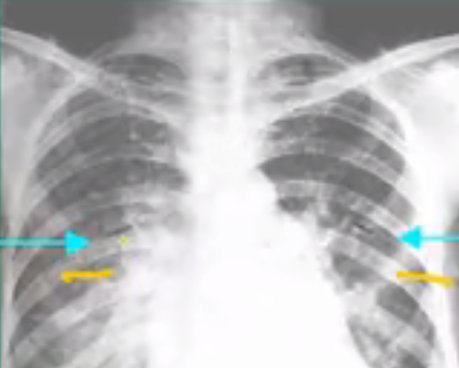
   3. 评价心脏功能
      1. 超声心动图
      2. 放射性核素心脏检查
3. 有创血流动力学检查
   1. 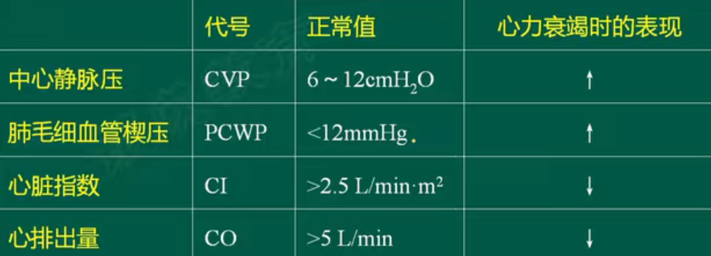

## 诊断与鉴别诊断--肺疾病
“见过的和没见过的”

## 治疗方法
治疗目的：缓解症状（生活方式的改变，利尿剂），提高运动耐量（洋地黄），改善生活质量，防止心肌损害进一步加重（**功能学+影像学**1. 超声看射血分数、标志物检测脑钠肽和肌钙蛋白2. 结构逆转），降低死亡率（治疗水平不可比性，比较规范化治疗依据，达到了最大耐受剂量--**武器**左室辅助装置的诞生--三年生存率与心脏移植一致）
### 药物（8大药物）
1. 利尿剂（排钠排水--长期联合间歇应用）
   1. 慢性心衰尿酸高不能用氢氯噻嗪
   2. 氢氯噻嗪和螺内酯常常一起使用
   3. 呋塞米强利尿剂，副作用为低血钾（袢利尿剂）
   4. 在呋塞米和氢氯噻嗪药物之前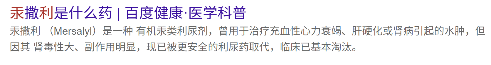
2. ACEI（普利）\ARB（沙坦）--两者不能联用
   1. 机制：抑制交感-肾素-血管紧张素系统，扩张血管，【预后】改善心室重塑--所有心力衰竭病人都可以用
   2. 抑制缓激肽、扩张血管
   3. |副作用|禁忌症|
      |----|----|
      |低血压|血压低于90mmHg|
      |肾功能一过性恶化|（肌酐＞265）|
      |高钾血症（醛固酮系统）|血钾>5.5|
      |干咳|干咳不能耐受|
      ||妊娠，对ACEI过敏（影响胎儿软骨发育）|
   4. ARNI
3. 【预后】醛固酮受体拮抗剂（螺内酯）（坚持差血钾） 
      1. 依普利酮（老龄、糖尿病和肾功能不全的病人）
4. 肾素抑制剂
      1. 阿利吉仑、雷米吉仑、依那吉伦
5. β受体阻滞剂（急性心衰不能用，慢性心衰没有禁忌症都要用--延缓心室重构）非选择性--卡维地洛
    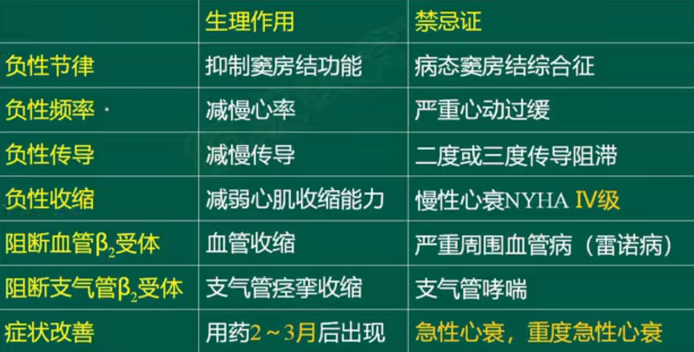
   禁忌症：病态窦房结综合征、严重心动过缓、二度或三度传导阻滞
   心肌β1--负性节律、负性频率、负性传导、负性肌力
   血管β2--血管收缩
6. 洋地黄类药物--能够改善心衰的临床症状，但不能改善预后的药物（钠出钙入）
   1. 最佳指征--收缩性心衰
   2. 慎用
      1. 高排量心衰--贫血心、甲亢心、心肌炎、心肌病所致心衰
      2. 容易发生洋地黄中毒--肺心病、心梗、缺血性心肌病所致心衰
      3. 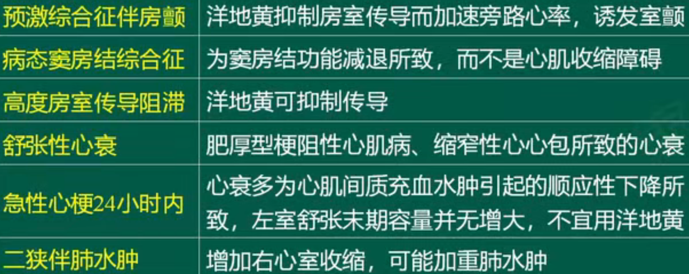
      4. 洋地黄毒性反应
            |副作用|具体表现|
            | ---- | ---- | 
            |心律失常|特征表现：快速房性心律失常伴房室传导阻滞|
            |胃肠症状|恶心呕吐厌食|
            |神经系统症状|视力模糊、黄视、绿视、定向障碍、意识障碍
      5. 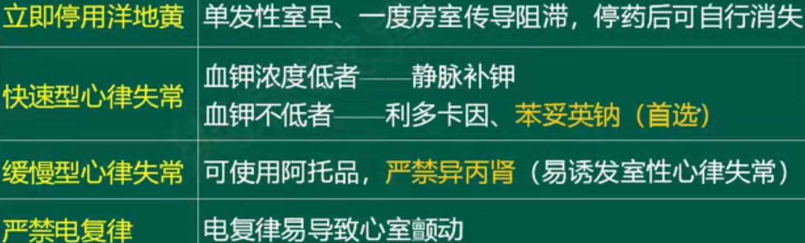
## 非药物治疗
1. 介入治疗和外科治疗
2. 心脏移植
3. 心室辅助装置（LAVD）

4. 电治疗（电复律，电除颤，起搏）
   1. 实现心房心室同步
   2. 三枪起搏器

## 尽量避免应用的药物
+ 大多数钙拮抗剂(氨氯地平，非洛地平除外)
+ 大多数抗心律失常药(胺碘酮除外)
+ 非类固醇抗炎药

## 医考帮补充知识点
1. 舒张性心衰可以单独发生，但收缩性心衰一定伴有舒张性心衰
2. 药理：
   1. 狭不扩，闭不缩
      1. 狭窄射血量减少，扩血管--低血压和休克
      2. 关闭不全血液反流，心室内血液增加，缩血管血压升高，加重后负荷射血更困难引起心衰
   2. 洋地黄
      1. 洋地黄中毒：室早二联律最常见，三度房室传导阻滞最特征
      2. 洋地黄服用史+胃肠道反应+神经系统症状+心室率<50次/分 = 洋地黄中毒
      3. 洋地黄效应：鱼钩
      4. “如果心率只有30多，肯定是完全性传导阻滞，此时的心率反映的是心室率，只有洋地黄才会导致传导阻滞，刚好患者又有服用地高辛”
      5. 洋地黄中毒应该补钾盐：恶心呕吐说明钾含量不足，此时应该先补钾，血钾浓度正常再用利多卡因/苯妥英钠
      6. 洋地黄中毒
      7. 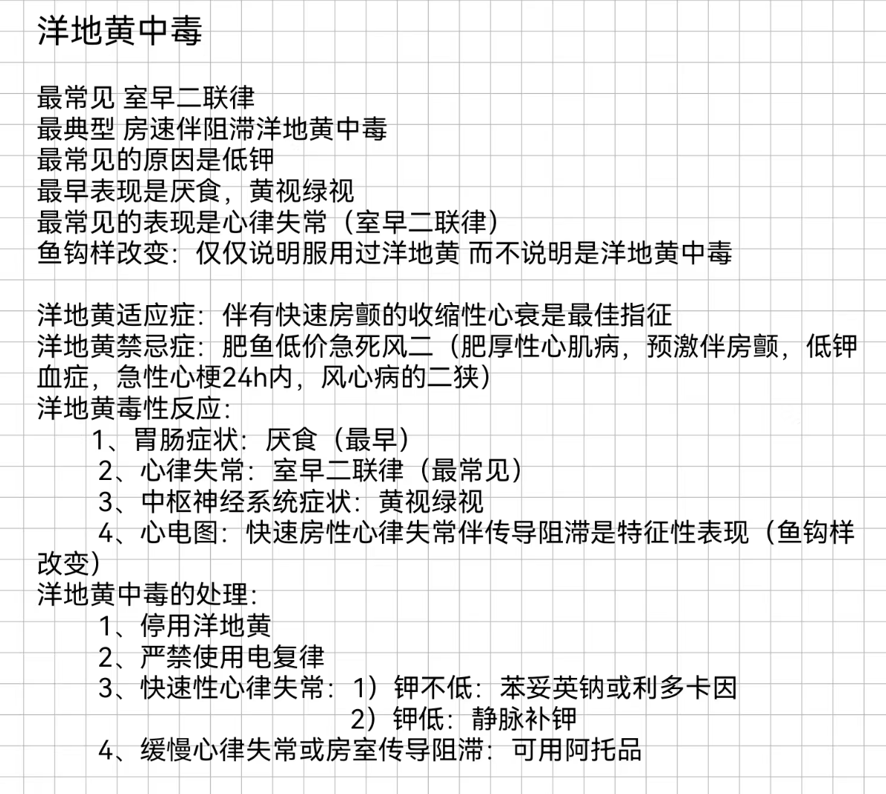