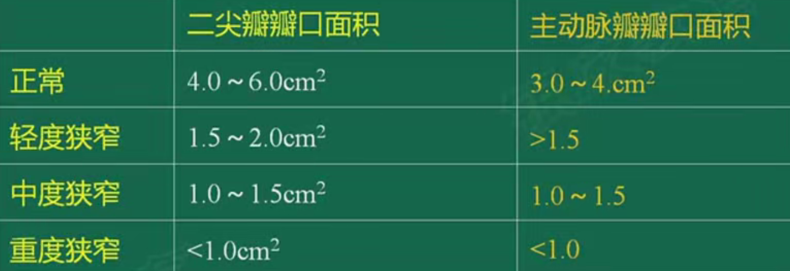
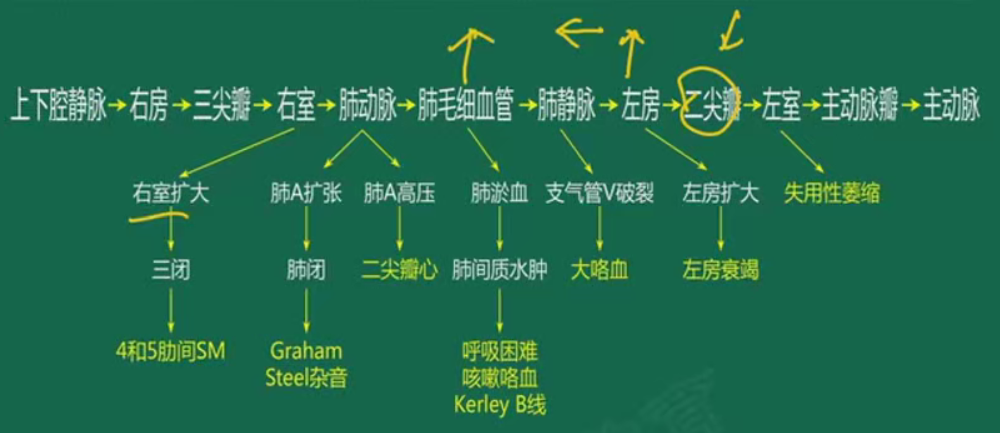
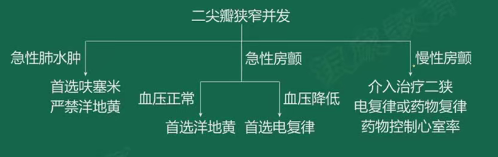
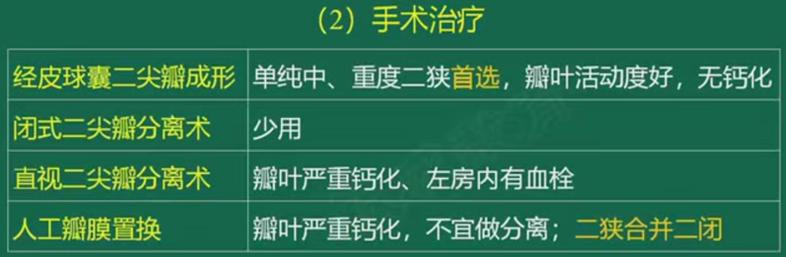
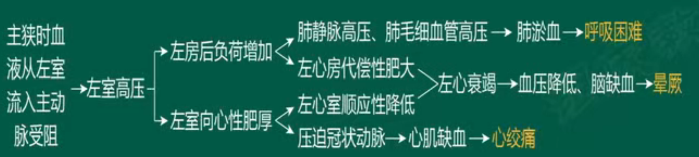
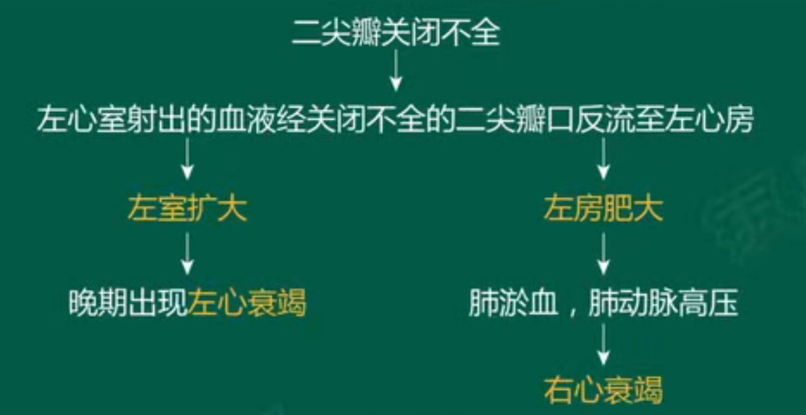
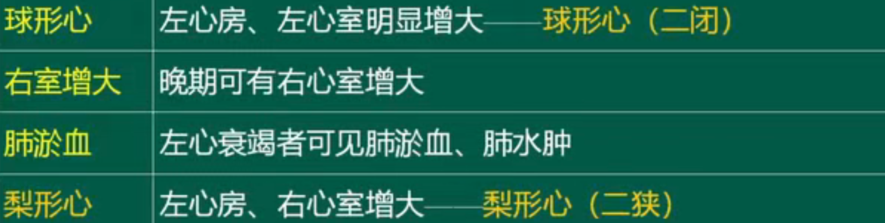
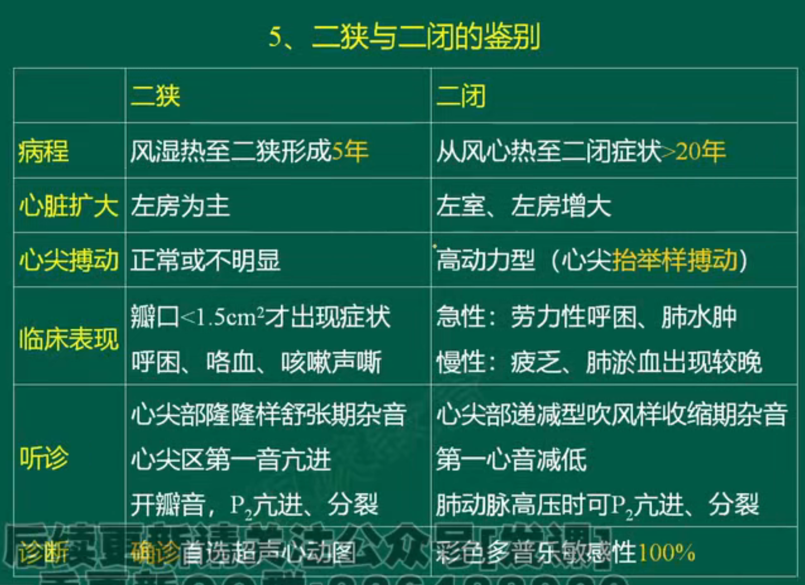
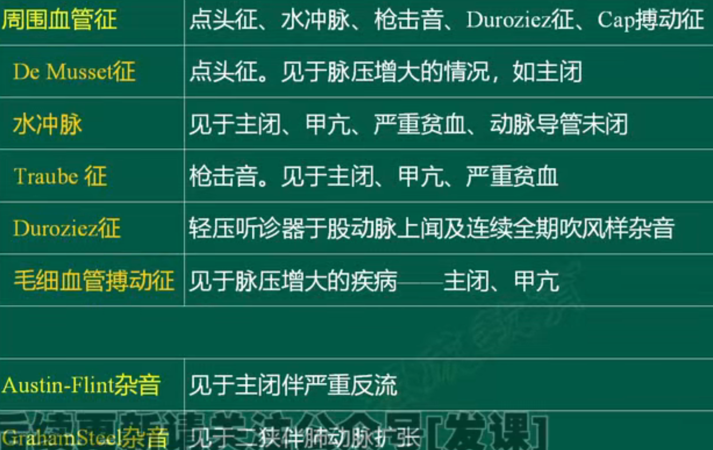

# 心瓣膜病

## 二尖瓣狭窄
### 瓣口面积及狭窄分度（与主动脉瓣对比记忆）

### 病理生理

早期大咯血，晚期痰中带血。

二狭-心尖部闻及舒张中晚期低调的隆隆样杂音，递增行，局限，用力呼吸可使杂音增强，常伴舒张期震颤。

### 并发症治疗总结--执业医常考

### 手术治疗

## 二尖瓣关闭不全
### 病理生理

### X线

### 风心二病鉴别

## 主动脉狭窄
### 病理生理机制

## 周围血管征--舒张压↓，脉压↑

